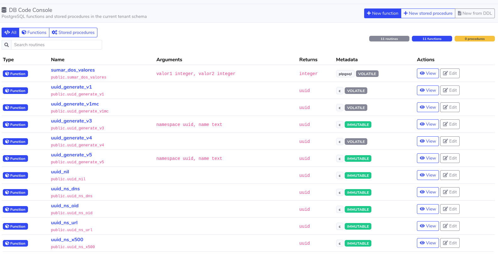
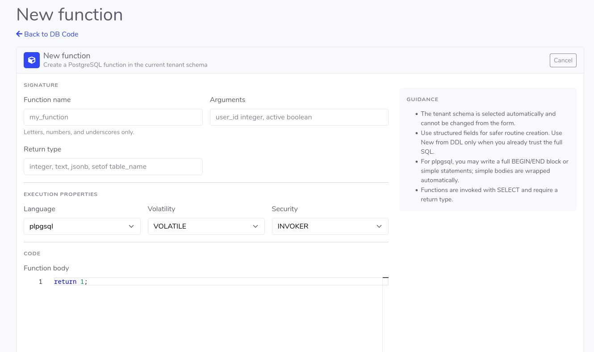
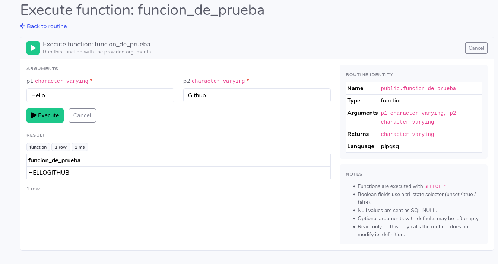

# Saltcorn DB Code

Saltcorn DB Code is a Saltcorn plugin for inspecting and managing PostgreSQL database code objects from the Saltcorn UI.

- List functions and procedures in the current tenant schema.
- View routine metadata.
- View the full SQL definition returned by PostgreSQL.
- Filter a shared routine list by function or stored procedure.
- Create functions and stored procedures with structured forms and Saltcorn's code editor for the body.
- Create routines from full DDL when you already have the exact PostgreSQL SQL.
- Edit routines from their current PostgreSQL DDL.
- Delete routines with confirmation and without default `CASCADE`.
- Call routines from Saltcorn events/workflows through the `DB_Routine` action.
- Restrict access to Saltcorn administrators.
- Show a clear unsupported-database message on SQLite.

TODO

- Storeds as Action from triggers, callable from scheduled or API calls

## Some Screenshots








## Installation

You can install directly from your saltcorn instance. 
- Go to Settings - Modules
- Choose "Add another module" under top right dropdown menu.
- Fill name, source (npm) and saltcorn-db-code as Location.
- Create a View with View Pattern DBCodeConsole

From the Saltcorn checkout:

```bash
cd /home/devgiu/dev/saltcorn
./packages/saltcorn-cli/bin/saltcorn dev:localize-plugin db-code /home/devgiu/dev/saltcorn-db-code
```

After loading the plugin, create a Saltcorn view with the `DBCodeConsole` view pattern. This is the recommended entrypoint because it behaves like other Saltcorn plugin consoles and can be added to menus normally.

Alternative direct route for development:

```txt
/db-code
```

Administrators can add either the created view URL, usually `/view/<view-name>`, or the direct `/db-code` route to a normal Saltcorn menu link.

## Development commands

```bash
npm test
npm run lint
```

## Scope

The first milestone is read-only PostgreSQL routines. Creation, editing, deletion, execution, configuration, and additional database object types are tracked in `PLAN.md` and `docs/TODO.md`.
